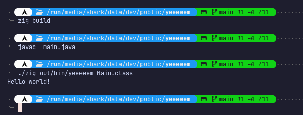

# yeeeeem

A very simple JVM written in zig, supporting a subset of it's instructions and capabilities.

## Getting started
First you need to install zig. If you have it installed, you can run the following command to build yeeeeem:

```console
zig build
```


then you need to have some sort of java class. For a simple hello world, create a file `main.java`

```java
class Main {
    public static void main(String[] args) {
        System.out.println("Hello, world!");
    }
}
```

then compile it to a class file via

```console
javac main.java
```

you can then run it in yeeeeem


```console
./zig-out/bin/yeeeeem Main.class
```





### Why the name?

Well, since we want to make fun of java, we call it yava.

So it is a YVM or Yava Virtual Machine, this looks bad, so why not YM.

And since we have fun it's yeeeeem!

